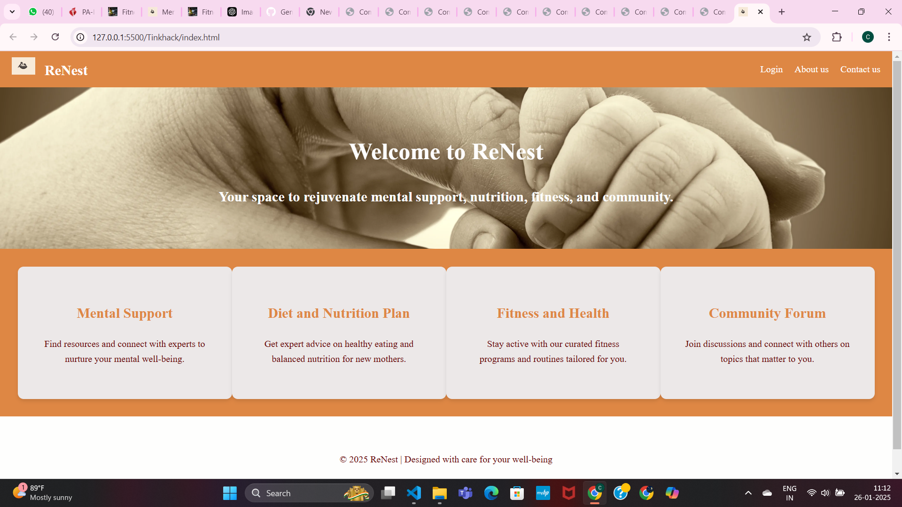
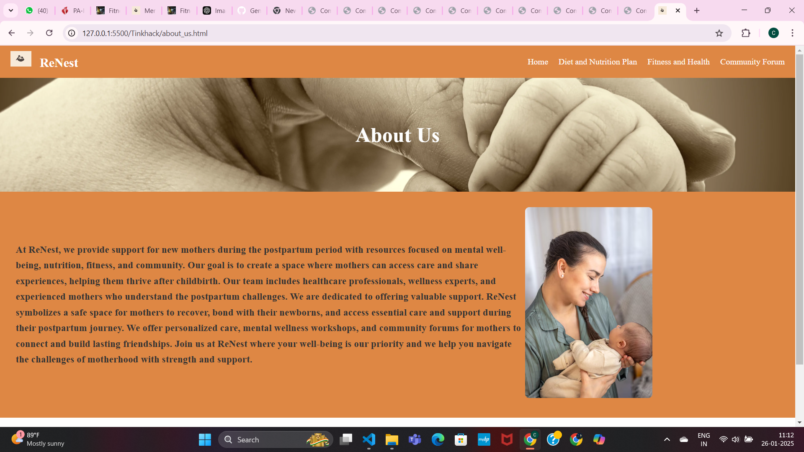
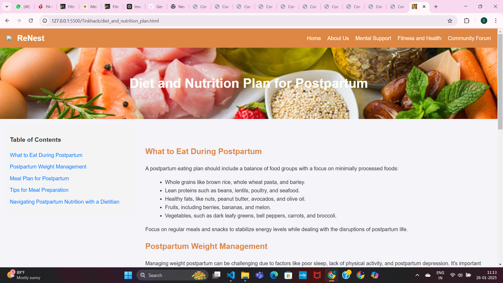

# [Project Name] 🎯

## Basic Details
### Team Name: ERROR 404

### Team Members
- Member 1: CHINNU ISSAC- LBSITW
- Member 2: FATHIMA SHADHA C P- LBSITW
- Member 3: GOURY NANDA IJ - LBSITW

### Hosted Project Link

http://127.0.0.1:5500/Tinkhack/index.html

### Project Description
Website -Postpartum care for women. 
Mainly focuses on mental and physical health.
can connect with community.

### The Problem statement
Communication with like minded people

### The Solution
website

## Technical Details
### Technologies/Components Used
For Software:
- [Languages used] HTML ,CSS,JavaScript
- [Frameworks used]
- [Libraries used]
- [Tools used]

For Hardware:
- [List main components]
- [List specifications]
- [List tools required]

### Implementation
For Software:
# Installation
[commands]vs code
git
github

# Run
[commands]

### Project Documentation
For Software:

# Screenshots (Add at least 3)

*Add caption explaining what this shows*

*Add caption explaining what this shows*

*Add caption explaining what this shows*

# Diagrams

*Add caption explaining your workflow*

For Hardware:

# Schematic & Circuit

*Add caption explaining connections*

*Add caption explaining the schematic*

# Build Photos

*List out all components shown*

*Explain the build steps*

*Explain the final build*

### Project Demo
# Video
[Add your demo video link here]
*Explain what the video demonstrates*

# Additional Demos
[Add any extra demo materials/links]

## Team Contributions
- [Name 1]: [Specific contributions]
- [Name 2]: [Specific contributions]
- [Name 3]: [Specific contributions]

---
Made with ❤️ at TinkerHub
